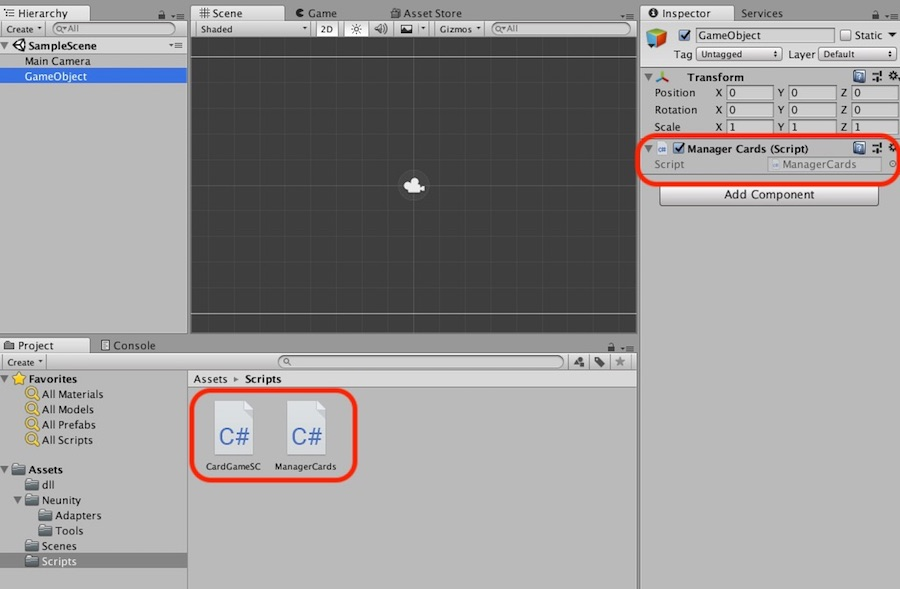

# Debuging/CodeSharing NEO SC by Neunity

Neunity is a framework providing the toolset and workflow to increase the development effiency for NEO Smart Contracts (SC) and C# Dapps. In this article, we'll introduce how to use Visual Studio to debug NEO SC(C#).


## Sample Process

We'll demostrate an Unity project example. But you'll find it's also available for other C# Dapps.

1. Download Neunity project from [HERE](https://github.com/norchain/Neunity) and unzip it. 
2. Open Neunity.sln, 


## The Purpose

One of the most outstanding challenge of developing NEO Dapps/SC is on the blockchain interaction. To test/debug the SC we have to face the following challenges, comparing with the conventional app development:

- **Chain Setup**: We need to setup a private chain or apply for some GAS from testnet, which sometimes kills hours. [neocompiler.io](neocompiler.io) is the best acceleration we found so far, with execellent development experience and the whole gamut of tools. [privatenet docker image](https://github.com/CityOfZion/neo-privatenet-docker) is another smart choice if you have to work offline (in subway or on airplane, a café with phishing WIFI). Another advantage of local privatenet is that you would never worry about your hands frozen during winter - Well, I'm in Canada and I guarantee it.
- **Deployment**: To test even a tiny value change, you have to re-deploy the smart contract. If the wallet is lack of GAS, we need to wait for a few blocks for GAS claiming even we are the richest in the world. Then we wait another couple of blocks for SC deployment. 
- **Logging/Debug**: No breakpoint, no step in, The only thing we lean on is `Runtime.Notify` supporting only byte array (Not sure `Runtime.Log`, I didn't try it). Then we do the type conversion to understand the symptom, feeling like some sort of encrypted telegram from a spy.
- **Logic Feature Restrictions**: NEO smart contract does not support all .Net framework syntax, frameworks, or language features (type conversion, byte munipulation, class method declaration, etc.). It causes runtime confusion since the compiler doesn't complain all of them. eg. a [Ternary issue](https://github.com/NeoResearch/learning-examples/blob/master/BadExamples.md) which blocked my friend's project a few days.


Through the team [Norchain](http://norchain.io/home/)'s experience during the [NEO Game Competition](http://neo.game/), we are trying to alleviate the above pains for C# Dapps. The essential ideas are:

1. During Development/Debug period, embed the SC code (by C#) into client, and invoke them via a mock RPC call. So we can direct put breakpoints into SC and debug them chainlessly. 
2. During Test/Deployment period, change a few references in the SC and client code (without logic change), then both can work in a chain powered envrionment.
3. Avoid the SC logic from using any restricted logic features as much as possible.


## The Practice


Neunity has three layers. Application layer is the top layer of in Neunity's structure, whereas the only layer requiring the developer's implementation. Application layer logic is categorized into two parts:

**Offchain Logic**: The logic that developers would't put into SC. eg. The UI, ViewController, etc.

**Contract Logic**: The core SC logic, including the asset managment, public algorithms, etc. 

Let's take a look at the following *contract logic* `CardGameSC.cs`. 

```csharp
/** ----------------------------
CardGameSC.cs
Check ./Neunity/Samples/SampleUnity/Assets/Scripts/CardGameSC.cs for the complete implementation
--------------------------------*/
using System;
using System.Numerics;
using Neunity.Adapters.Unity;	//Adapter Layer. Uncomment this line to use this class in Client
//using Neunity.Adapters.NEO;	//Adapter Layer. Uncomment this line to use this class in SC
using Neunity.Tools;		//Tool Layer. Storage, Serialization, etc.

namespace Neunity.CardGame
{
    public class CardGame : SmartContract
    {
        //... Some Other logic ...
        
        // The definition of class Card
        public class Card
        {
            public BigInteger type;   
            public byte[] lvls;
            public BigInteger score;
            public string name;
        }
        
        // Customized Serialization for Card.
        public static byte[] Card2Bytes(Card card) => SD.JoinSegs2Seg(
            //... Neunity.Tools.SD manages Serialization/Deserialization.
        );

        // Customized Deserialization for Card
        
        public static Card Bytes2Card(byte[] data) => new Card
        {
        	// ... Neunity.Adapter.Op manages type conversation for different platforms 
        };

        // The Logic of merging two cards
        public static Byte[] CardMerge(byte[] cardData1, byte[] cardData2, string name)
        {
            Card card1 = Bytes2Card(cardData1);
            Card card2 = Bytes2Card(cardData2);
            Card card = new Card{
            	type = card1.type,
            	lvls = card2.lvls,
            	name = name,
            	birthBlock = Blockchain.GetHeight()
            };
            byte[] newCardData = Card2Bytes(card);
            
            //Neunity.Tools.IO manages the interaction of storage for different platforms.
            IO.SetStorageWithKeyPath(newCardData, "card", name);
            return newCardData;
        }

        //Main Entrance
        public static Object Main(string operation, params object[] args)
        {
            if (operation == "cardMerge")
            {
                byte[] cardData1 = (byte[])args[0];
                byte[] cardData2 = (byte[])args[1];
                string name = (string)args[2];

                return CardMerge(cardData1,cardData2,name);
            }
            if (operation == "getCard")
            {   //Used Internally Only
                byte[] cardData = (byte[])args[0];
                return Bytes2Card(cardData);
            }
            //... Other operations
            return false;
        }
    }
}
```

Then we directly embed `CardGameSC.cs` into Unity project, as shown in following screenshot.   



We also have the *offchain logic* `ManagerCards.cs` which is responsible for managing the card related operations. It calls `CardGameSC.cs` functions in a few places:

```cs
/** ------------------------------------
ManagerCards.cs
Check ./Neunity/Samples/SampleUnity/Assets/Scripts/ManagerCards.cs for the complete implementation
----------------------------------------*/
using UnityEngine;
using Neunity.SomeCardGame;

public class ManagerCards : MonoBehaviour {
	//... Other logic above
    //
    void MergeCards(){
        Debug.Log("Merge Begin");
        CardGame.Card card1 = new CardGame.Card()	//1. Using the class Card from CardGameSC.cs
        {
            //... card1's properties
        };

        CardGame.Card card2 = new CardGame.Card()
        {
            //... card1's properties
        };

        byte[] b1 = CardGame.Card2Bytes(card1);	//2. Calling CardGameSC.cs method
        byte[] b2 = CardGame.Card2Bytes(card2);	//2. Calling CardGameSC.cs method

        //
        byte[] bn = (byte[])CardGame.Main("cardMerge", b1, b2, "NovaCard");	//3. Calling CardGameSC.cs Entrance Function "Main"

        CardGame.Card cardNew = CardGame.Bytes2Card(bn);	//2. Calling CardGameSC.cs method

        Debug.Log("New card's name:\t" + cardNew.name);

        string lvlString = "";
        for (int i = 0; i < cardNew.lvls.Length; i++){
            lvlString += cardNew.lvls[i].ToString() + ",";
        }
        Debug.Log("New card's lvls:\t" + lvlString);
        Debug.Log("New card's birthBlock:\t" + cardNew.birthBlock);
        Debug.Log("New card's type:\t" + cardNew.type);
    }
}
```


We've accomplished two important things !! First, via embedding `CardGameSC.cs` into client project, we shared the class definitions and the majority logic between SC and client.  Secondly, we can now direct debug the SC logic with testcases and breakpoints now.

In the Test/Deployment period, we need to:

1. In  `CardGameSC.cs` , change `using Neunity.Adapters.Unity;` to `using Neunity.Adapters.NEO;`
2. Combine `CardGameSC.cs`  with the file `./Neunity/Adapters/NEO.cs` and all classes in  `./Neunity/Tools` , then compile to .avm.

No logic change or adaption required.


## The Mechanism

The essential challenge of sharing the code between SC/client and to debug the SC is on the adapter layer.

Unlike the Application Layer and Tool Layer, Adapter Layer code shares only the method signatures rather than implementations between platforms.  This is due to different language features on different platforms. eg. conversions, concatenation and operators.

```cs
using System;
using System.Numerics;
using System.Text;

namespace Neunity.Adapters.Unity{
    public static class Op{
        public static byte[] BigInt2Bytes(BigInteger bigInteger) => bigInteger.ToByteArray();
        public static byte[] JoinTwoByteArray(byte[] ba1, byte[] ba2)
        {
            byte[] ret = new byte[ba1.Length + ba2.Length];
            Buffer.BlockCopy(ba1, 0, ret, 0, ba1.Length);
            Buffer.BlockCopy(ba2, 0, ret, ba1.Length, ba2.Length);
            return ret;
        }
        public static bool And(bool left, bool right) => left && right;
        
        public static byte[] SubBytes(byte[] data, int start, int length)
        {
            if (data.Length < start + length)
            {
                return new byte[0];
            }
            else
            {
                byte[] ret = new byte[length];
                Array.Copy(data, start, ret, 0, length);
                return ret;
            }

        }
    }
}
```

The implementation of same functions for NEO are:

```cs
using System;
using Neo.SmartContract.Framework;
using Neo.SmartContract.Framework.Services.Neo;
using Neo.SmartContract.Framework.Services.System;
using Helper = Neo.SmartContract.Framework.Helper;
using System.Numerics;

namespace Neunity.Adapters.NEO{
    public static byte[] BigInt2Bytes(BigInteger bigInteger)
    {
        if (bigInteger == 0) return new byte[1] { 0 };
        return bigInteger.AsByteArray();
    }
    
    public static byte[] JoinTwoByteArray(byte[] ba1, byte[] ba2) => ba1.Concat(ba2);
    
    public static bool And(bool left, bool right){
        if (left) return right;
        return false;
    }
   
    public static byte[] SubBytes(byte[] data, int start, int length) => Helper.Range(data, start, length);
}
```

Hopefully with the community's help, we can keep adding more functions there.

The future plan of `Neunity.Adapters` includes:

1. More test cases for every function from different platforms to ensure their return values are equal. That's the meaning of "Adapters".
2. Add more functions to mock blockchain in `Neunity.Adapters.Unity`

