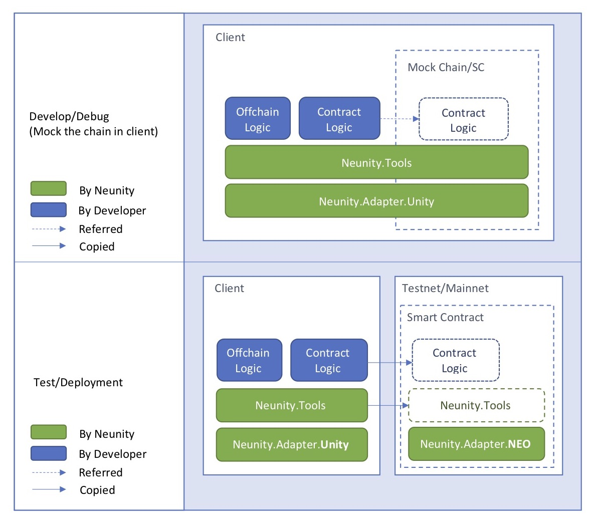

# Neunity

Neunity is a framework providing the toolset and workflow to increase the development effiency for NEO Smart Contracts (SC) and C# Dapps. Via Neunity, we can

* build testcases or put breakpoints to debug your SCs locally, dispensing testnet interaction. 
* reuse SC logic in corresponding Unity (or other .Net) client projects.
* avoid common NEO SC development mistakes as they are encapsulated.
* HTTP server-like SC developement flow.
* Flexible and convenient seralization and custom type managment.
* Other expanding features... 

Neunity's final target is **to make large-scale NEO blockchain projects practical**. It's still in very early stage so welcome suggestions and code contribution from the community. 

In General, Neunity provides a 3-layer structure demostrated in the following figure. 

* **Adapter Layer** provides unique upward interfaces and encapsulates the implementation differences between NEO SC and other C# application platforms. So we can make the local debugging and code sharing feasible.
* **Tool Layer** provides a series of tools to simplify and standardize (Optional) the flow for development. Currently we have NuTP for HTTPlike protocol, NuSD for seralization and NuIO for storage management.
* **Application Layer** is the layer that developers can focus on their busniess logic without concerning majority blockchain related knowledge or NEO related C# language restrictions.

Please refer to following articles to further understand how to utilize Neunity.

1. How to use Visual Studio to debug NEO SC(C#): [Introduction](https://github.com/norchain/Neunity/blob/master/NeunityVisualStudioIntegration.md). 
2. NuSD: Neunity Serialization.[Introduction](https://github.com/norchain/Neunity/blob/master/NeunityBytesSeralization.md)
3. NuTP: Neunity Transfer Protocol, a HTTP-like Application layer communication protocol between NEO smart contract and client Dapp.[Introduction](https://github.com/norchain/Neunity/blob/master/NeunityTransferProtocol.md)
4. Other features: [Storage](https://github.com/norchain/Neunity/blob/master/NeunityStorageManagement.md), [Continous Integration](https://github.com/norchain/Neunity/blob/master/NeunityContinuousIntegration.md), etc.

**Please provide more failure testcases and suggest more functions and tactics. With the community's help, we can make it more powerful.** 

Contact: @dprat0821 on Github and Discord. Thanks
