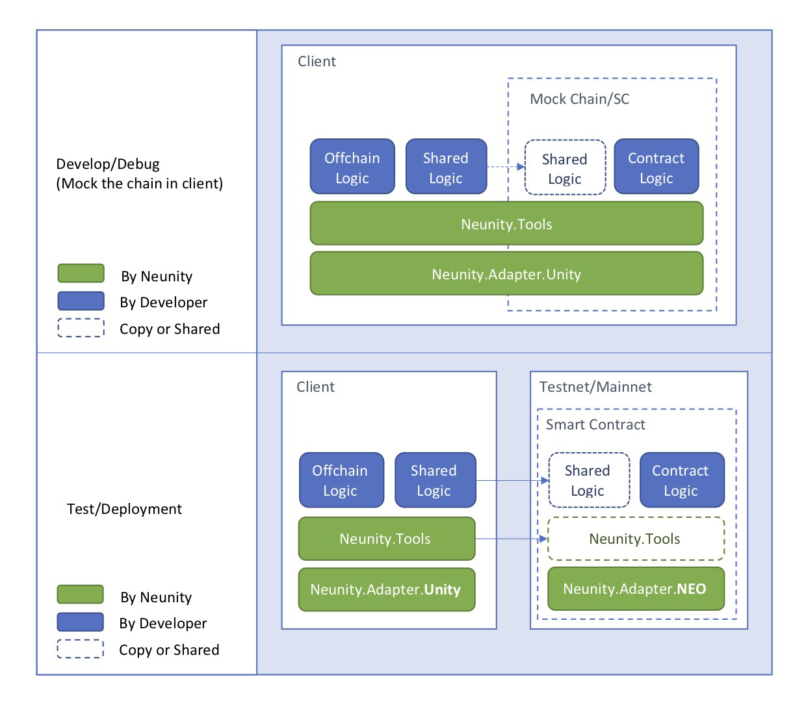

# Neunity

## The Purpose

One of the most outstanding challenge of developing NEO Dapps/Smart Contract(SC) is the blockchain interaction. To test/debug the SC we have to face the following challenges, comparing with the conventional app development:

* **Chain Setup**: We need to setup a private chain or apply for some GAS from testnet, which sometimes kills hours. [neocompiler.io](neocompiler.io) is the best acceleration we found so far, with execellent development experience and the whole gamut of tools. [privatenet docker image](https://github.com/CityOfZion/neo-privatenet-docker) is another smart choice if you have to work offline (in subway or on airplane, a café with phishing WIFI). Another advantage of local privatenet is that you would never worry about your hands frozen during winter - Well, I'm in Canada and I guarantee it.
* **Deployment**: To test even a tiny value change, you have to re-deploy the smart contract. If the wallet is lack of GAS, we need to wait for a few blocks for GAS claiming even we are the richest in the world. Then we wait another couple of blocks for SC deployment. 
* **Logging/Debug**: No breakpoint, no step in, The only thing we lean on is `Runtime.Notify` supporting only byte array (Not sure `Runtime.Log`, I didn't try it). Then we do the type conversion to understand the symptom, feeling like some sort of encrypted telegram from a spy.
* **Logic Feature Restrictions**: NEO smart contract does not support all .Net framework syntax, frameworks, or language features (type conversion, byte munipulation, class method declaration, etc.). It causes runtime confusion since the compiler doesn't complain all of them. eg. a [Ternary issue](https://github.com/NeoResearch/learning-examples/blob/master/BadExamples.md) which blocked my friend's project a few days.


Through the team [Norchain](http://norchain.io/home/)'s experience during the [NEO Game Competition](http://neo.game/), we are trying to alleviate the above pains for C# Dapps. The essential ideas are:

1. During Development/Debug period, embed the SC code (by C#) into client, and invoke them via a mock RPC call. So we can direct put breakpoints into SC and debug them chainlessly. 
2. During Test/Deployment period, change a few references in the SC and client code (without logic change), then both can work in a chain powered envrionment.
3. Avoid the SC logic from using any restricted logic features as much as possible.

We'll talk about how to realise them in the following section.


## The Structure

The C# applications may have various restrictions of .Net framework adaption. In this section, we'll take the world's famous game engine Unity for example, since we already implemented this part and tested working well with Norchain's game [CarryBattle](http://norchain.io/home/carrybattle.html). 

In order to realise the targets mentioned at the end of the previous section, let's consider a three layer structure demostrated in the following figure. 



### Application Layer

This is the top layer of the whole Dapp, also the only layer that requires the developer's implementation in Neunity's structure. Application layer logic is divided into two categories:

1. **Offchain Logic**: Any logic that developers don't want to put into SC. eg. The UI, ViewController, etc.
2. **Contract Logic**: The logic that developers willing to put into SC. eg. the assert managment, public algorithms, etc. These logic can be shared between SC and client. Let's check the following snippet: 

```csharp
public class Card
{
    public BigInteger type;   //TypeArmy
    public byte[] lvls;    // Range: 0 - 255
    public BigInteger owner;
    public BigInteger score;
    //... Other fields ... 
}

public static byte[] CardToBytes(Card card)
{
    //... Customized Serialization for Card
}

public static Card BytesToCard(byte[] data) => new Card{
    //... Customized Deserialization for Card
};


public static Object CardMerge(params object[] args)
{
    if (args.Length < 3) return false;
    // ... The Logic of the result of merging the cards
}

public static Object Main(string operation, params object[] args)
{
    if (operation == "cardMerge")
    {
        return CardMerge(args);
    }
    if(operation == "getCard") {	//Used Internally
        byte[] cardData = (byte[])args[0];
        return BytesToCard(cardData);
    }
	//... Other operations
    return false;
}

```

In the above snippet, we have the definition of the class `Card` along with related operations. These logic can be used in SC, and also very useful on the Unity side to make the players preview the merge result before invoking the contract.

It's recommended that the developers to seperate the offchain, contract and shared logic into different files while developing/debuging, while put the contract and shared logic as parts of SC during 


### Tool Layer


### Adapter Layer


### Feature Table


|             | Application Layer    | Tool Layer    | Adapter Layer               |
| ----------- | -------------------- | ------------- | --------------------------- |
| Provided By | Developers           | Neunity       | Neunity                     |
| Namespace   | Picked by Developers | Neunity.Tools | Neunity.Adapters.{Platform} |
|             |                      |               |                             |
|             |                      |               |                             |
|             |                      |               |                             |


